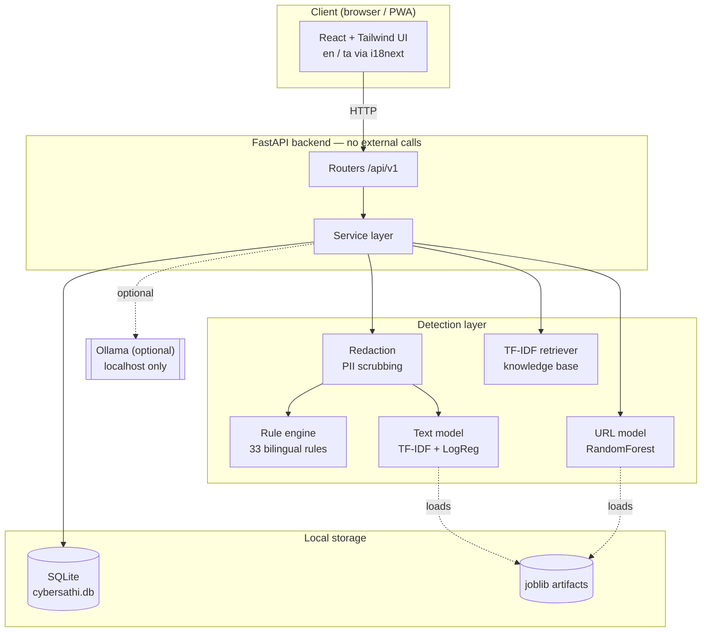
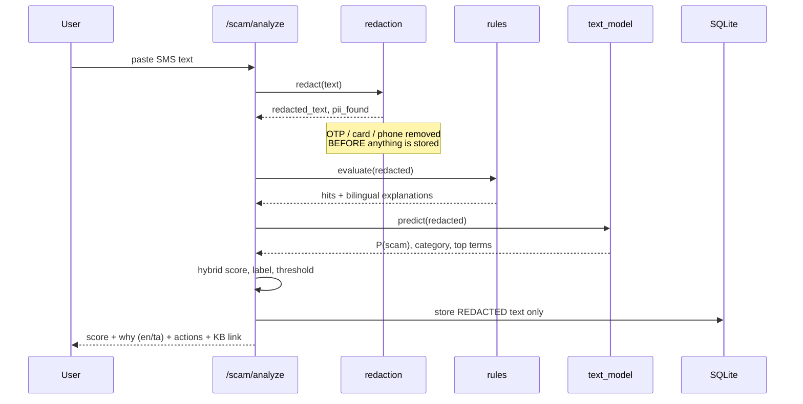
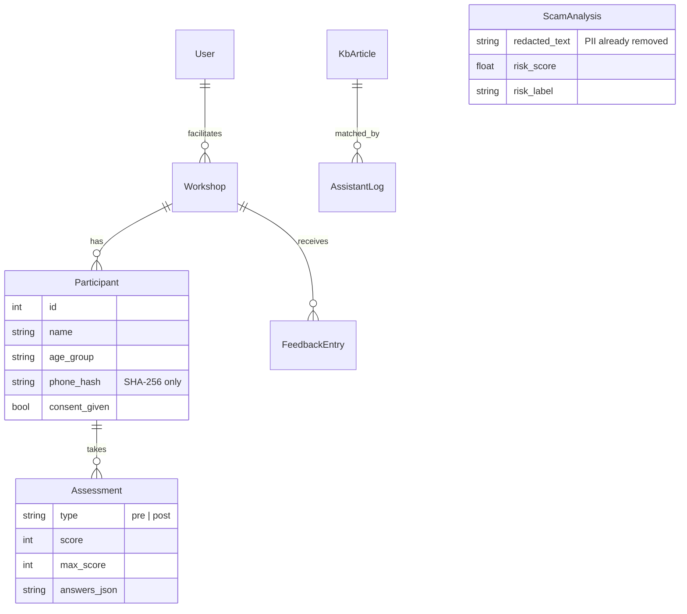
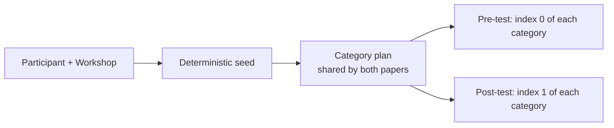

# Architecture

## System overview



**No arrow leaves the machine.** That is the defining architectural constraint: the app must work
in a village hall with no internet, and must require no API key.

---

## The hybrid scoring decision

The scam score is a weighted blend, not a pure model output:

```
risk_score = 0.55 × P(scam | ML)  +  0.45 × rule_score
```

Why not just use the model?

| Concern | Rule engine | ML model |
|---|---|---|
| Explains itself to a 70-year-old | ✅ each rule carries a bilingual "why" | ❌ coefficients are not an explanation |
| Handles a scam script never seen in training | ✅ patterns are hand-written | ❌ limited to the training distribution |
| Generalises to novel phrasing | ❌ brittle | ✅ that is its strength |
| Survives a synthetic-data caveat | ✅ independent of the corpus | ❌ metrics are an upper bound |

Giving rules 45% is deliberate: it means a message can be flagged high-risk on rule evidence
alone, which is what keeps the system useful against scams invented after the model was trained.

A near-certain rule (weight ≥ 0.9) also **overrides the model's category**. The model happily
folds a digital-arrest message into the broad "impersonation" class; the rule is more precise,
and the category determines which knowledge-base article the user is sent to.

### Rule scoring uses saturating addition

```python
score = 0.0
remaining = 1.0
for w in sorted(positive_weights, reverse=True):
    score += w * remaining
    remaining = 1.0 - score
score = max(0.0, score - negative_weights)
```

A plain sum would let five weak signals reach certainty. Saturating addition means each
additional signal contributes less, and **negative-weight rules** (legitimacy signals such as
*"do not share this OTP with anyone"*) pull the score back down — which is how a genuine bank
alert scores 0 despite containing the word "OTP".

---

## Request flow: scam analysis



Thresholds: `< 35` safe, `35–69` suspicious, `≥ 70` high risk.

---

## Data model



`Assessment` has a unique constraint on `(participant_id, type)` — one pre-test and one
post-test per participant, so a re-submission updates rather than duplicating.

---

## Assessment design — why it is methodologically valid

Two decisions make the reported improvement defensible rather than decorative.

### 1. Matched but disjoint question sets



- **Same category profile** in both papers — otherwise you are comparing difficulty, not learning.
- **Different items** — otherwise the post-test measures recall of specific questions.
- **Deterministic** — reloading the page does not reshuffle the paper.

Measured overlap is currently **0/10 items** with matched categories, verified by
`tests/test_api.py::test_pre_and_post_are_matched_but_disjoint`.

*Limitation:* a category holding only one question would unavoidably repeat. The quiz bank
therefore keeps at least two questions per category.

### 2. The division-by-zero guard

The project's headline formula is:

```
improvement % = ((post − pre) / pre) × 100
```

This is **undefined when `pre = 0`** — which is not hypothetical. In the seeded demo cohort,
8 of 126 participants score zero on the pre-test, and that is realistic for first-time internet
users at a senior-citizens session.

A naive implementation either crashes with `ZeroDivisionError` or prints `inf`. CyberSathi
instead returns `improvement_percentage = None` and supplies two alternatives:

| Metric | Formula | Defined when pre = 0? |
|---|---|---|
| Improvement % | `(post − pre) / pre × 100` | ❌ |
| Absolute gain | `post − pre` | ✅ |
| Normalized gain (Hake) | `(post − pre) / (max − pre)` | ✅ |

All three are returned by the API, shown in the UI, and included in the CSV export, alongside a
plain-language note explaining why the percentage is absent for those rows.

### A third caveat the dashboard raises by itself

Ratio-based improvement is **skewed upward by small denominators**: a participant going from
1/10 to 5/10 registers as **+400%**. In the demo cohort this pushes the mean to ~87% while the
median is 75%.

The dashboard detects this (mean > 1.15 × median) and returns an `interpretation_note` telling
you to quote the **median** and **Cohen's d** as headline figures, because both are robust to
that distortion. Quote the mean without that context and a careful examiner will take it apart.

---

## Statistics reported

| Statistic | Purpose |
|---|---|
| Mean / median pre and post % | Central tendency |
| Paired-samples t-test | Is the change statistically significant |
| Cohen's d | How large the effect is, independent of sample size |
| % moved low → aware | Practical, human-readable outcome |
| Undefined-improvement count | Transparency about the `pre = 0` rows |

The t-test is hand-implemented (`paired_t_test`) so the formula can be shown in the report, with
scipy used only for the p-value. Zero-variance input (every participant gaining identically)
correctly returns `None` rather than an infinite t-statistic.

---

## Layering rules

```
api/v1/      thin routers — validation and HTTP only, no business logic
services/    all business logic
ml/ nlp/     detection and retrieval, no database access
models.py    ORM
```

One rule worth naming: **the retriever caches plain dicts, never ORM instances.** SQLAlchemy
objects are bound to the session that loaded them; caching them across requests raises
`DetachedInstanceError` the moment an attribute is touched. This was a real bug found during
development — the assistant worked on the first request and failed on every one after.

---

## Graceful degradation

| Missing | Behaviour |
|---|---|
| Trained models absent | Rule engine + heuristics only; app still runs and says so at `/meta/status` |
| Ollama not installed | Assistant uses TF-IDF retrieval; `ENABLE_LLM=false` is the default |
| No Tamil font for PDFs | Certificate generates in English with a visible note |
| No internet | Everything works — this is the design target |
