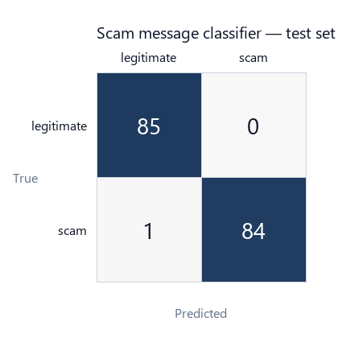
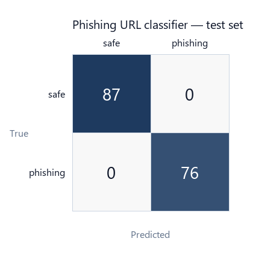
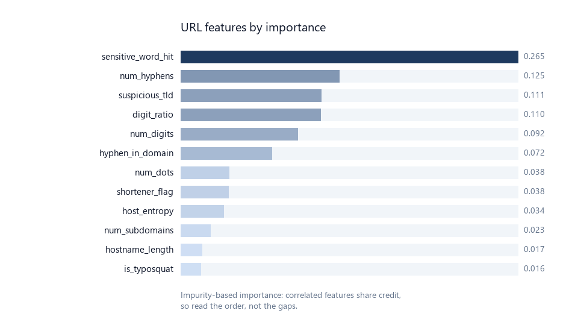

# ML Metrics

Generated by `ml_training/evaluate.py`. Do not edit by hand — re-run after training.

---

## 1. Scam message classifier

Word (1–2 gram) + character (3–5 gram) TF-IDF, union-vectorised, into a calibrated
Logistic Regression. Character n-grams are what make Tamil and Tanglish work without a stemmer.

| Property | Value |
|---|---|
| Trained at | 2026-09-20T07:27:30.960160+00:00 |
| Corpus size | 850 messages |
| Scam / legitimate | 423 / 427 |
| Tamil + Tanglish rows | 298 (35.1%) |
| Best hyper-parameters | `{'clf__C': '1.0'}` |

### Binary (scam vs legitimate)

| Metric | Value |
|---|---|
| Test accuracy | 0.9941 |
| Test macro-F1 | 0.9941 |
| Precision (scam) | 1.0000 |
| Recall (scam) | 0.9882 |
| 5-fold CV macro-F1 | 0.9988 ± 0.0024 |

| true \ predicted | legitimate | scam |
|---|---|---|
| **legitimate** | 85 | 0 |
| **scam** | 1 | 84 |

### Scam category classifier

| Metric | Value |
|---|---|
| Classes | 12 |
| Accuracy | 0.9647 |
| Macro-F1 | 0.9476 |

Categories: `banking`, `courier_parcel`, `digital_arrest`, `electricity_bill`, `impersonation`, `investment`, `job`, `kyc`, `loan`, `lottery`, `otp`, `social_media`

---

## 2. Phishing URL classifier

Random Forest over 25 static, network-free features.
The URL is never fetched.

| Property | Value |
|---|---|
| Trained at | 2026-09-20T07:28:15.116108+00:00 |
| Corpus size | 815 URLs |
| Phishing / safe | 381 / 434 |
| Best hyper-parameters | `{'max_depth': 'None', 'min_samples_leaf': '1', 'n_estimators': '200'}` |
| Test accuracy | 1.0000 |
| Test macro-F1 | 1.0000 |
| Precision (phishing) | 1.0000 |
| Recall (phishing) | 1.0000 |
| ROC-AUC | 1.0000 |
| 5-fold CV macro-F1 | 0.9975 ± 0.0030 |

| true \ predicted | safe | phishing |
|---|---|---|
| **safe** | 87 | 0 |
| **phishing** | 0 | 76 |

### Top features by importance

| # | Feature | Importance |
|---|---|---|
| 1 | `sensitive_word_hit` | 0.2654 |
| 2 | `num_hyphens` | 0.1248 |
| 3 | `suspicious_tld` | 0.1106 |
| 4 | `digit_ratio` | 0.1103 |
| 5 | `num_digits` | 0.0920 |
| 6 | `hyphen_in_domain` | 0.0716 |
| 7 | `num_dots` | 0.0384 |
| 8 | `shortener_flag` | 0.0377 |
| 9 | `host_entropy` | 0.0341 |
| 10 | `num_subdomains` | 0.0233 |
| 11 | `hostname_length` | 0.0167 |
| 12 | `is_typosquat` | 0.0159 |

---

## 3. How to read these numbers — important

**These scores are an upper bound, not expected field accuracy.** Quote them with this caveat
in your report; it is the first thing a careful examiner will probe.

1. **The corpus is synthetic.** Both datasets are generated from templates in
   `ml_training/generate_datasets.py`, composed from publicly documented fraud patterns. No real
   victim messages and no live malicious domains are included — a deliberate ethical and legal
   choice. The consequence is that the two classes are far more cleanly separable than real
   traffic, which is why the figures approach 1.00.

2. **Held-out does not mean independent.** The test split comes from the same generator as the
   training split. It measures whether the model learned the generator's patterns, not whether
   it generalises to scams written by an actual fraudster.

3. **One leak was found and removed.** An earlier version of the URL generator gave phishing
   URLs `http://` and safe URLs `https://`, letting the model reach 100% accuracy on the
   `is_https` feature alone. The generator now makes phishing URLs predominantly HTTPS, which
   is both more realistic (free certificates are universal) and removes the shortcut.
   `is_https` no longer appears among the top features — evidence the fix worked.

4. **This is why the system is a hybrid.** The rule engine in `app/ml/rules.py` carries 45% of
   the scam score and does not depend on the training distribution at all. A scam script the
   model has never seen still trips the OTP, KYC or digital-arrest rules, and the rules are what
   produce the bilingual explanation shown to the user.

### To strengthen this for a dissertation

- Collect a small **real** validation set (100–200 messages) donated with consent at workshops,
  label it by hand, and report accuracy on that separately. Even 100 real messages is a far more
  credible number than 850 synthetic ones.
- Report per-language performance separately; Tamil has fewer rows than English.
- Add a confusion analysis of which scam categories are mistaken for each other.
